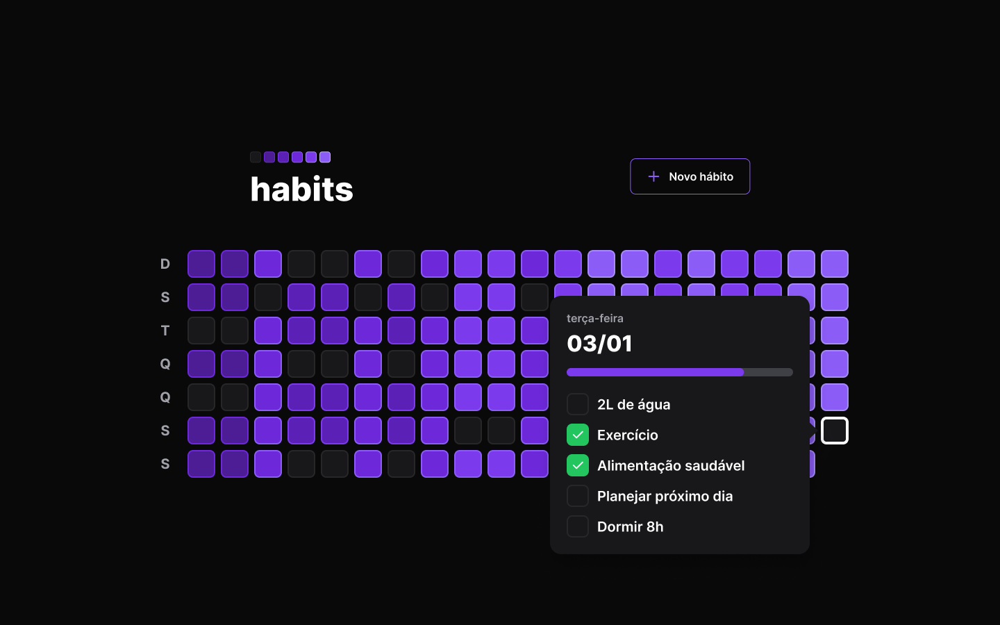

# Projeto Habit Tracker

## 💻 _Description_

Habit Tracker é um app de controle de hábitos para pessoas organizarem suas rotinas e melhorar sua produtividade!

## 💻  Projeto desenvolvido

## 💡  Info

O app contém apenas uma tela com o gráfico mostrando os dias da semana e os hábitos inserido pelo usuario.

## 💻 Tecnologias/Pacotes utilizados

**Backend**
- NodeJS
- TypeScript
- Fastify
- Prisma
- Dayjs
- Zod

**Frontend**
- ReactJS
- TypeScript
- ViteJS
- TailwindCSS
- Dayjs
- PhosphorReact
- Clsx
- Axios

## 👨‍💻 Autor

Gabriel Dias Catarin, desenvolvedor web | Bauru, São Paulo

[ LinkedIn](https://www.linkedin.com/in/gabriel-dias-260857207/)
&nbsp;
